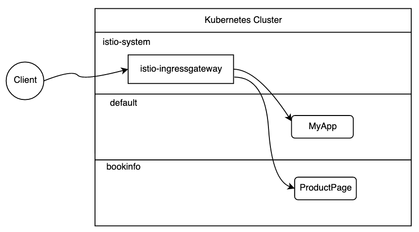

# Deploying your own Istio Ingress Gateway

### NOTE: Istio 1.5 only

Managed Istio on IKS comes with a `istio-ingressgateway` deployment in the `istio-system` namespace which you can use for routing traffic coming in to your mesh. 
```
~ 🏎  $ kubectl get deploy -n istio-system
NAME                   READY   UP-TO-DATE   AVAILABLE   AGE
istio-egressgateway    2/2     2            2           138m
istio-ingressgateway   2/2     2            2           138m
istiod                 2/2     2            2           138m
```
It is exposed as a LoadBalancer service and is bound to a public IP address.
```
~ 🏎  $ kubectl get svc -n istio-system istio-ingressgateway
NAME                   TYPE           CLUSTER-IP       EXTERNAL-IP     PORT(S)                                                                                                                      AGE
istio-ingressgateway   LoadBalancer   172.21.191.13   169.63.158.243   15020:32189/TCP,80:32229/TCP,443:30727/TCP,15029:31567/TCP,15030:32151/TCP,15031:31829/TCP,15032:32446/TCP,31400:31871/TCP,15443:32171/TCP   139m
```
This Ingress Gateway is available to use for all workloads in the mesh via the `Gateway` resource. For example:
```
apiVersion: networking.istio.io/v1alpha3
kind: Gateway
metadata:
  name: bookinfo-gateway
spec:
  selector:
    istio: ingressgateway # <-- 
  servers:
  - port:
      number: 80
      name: http
      protocol: HTTP
    hosts:
    - "*"
```
This means, all traffic coming into the mesh will flow thru this `istio-ingressgateway` deployment. 



### Additional Gateways

For the following reasons, some users choose to create additional ingress gateway deployments. 
1. Separate traffic flows between certain workloads or namespaces
2. Modify Ingress Gateway with customizations such as SDS.
3. Create an Ingress Gateway for private NLB traffic
4. Have an Ingress Gateway per zone for HA


*Note: The new Istio ingress gateway deployment is NOT managed by IKS. It is your responsiblity to manage and update this as necessary.*

## Instructions
These steps will create a new Istio ingress gateway deployment in a `bookinfo` namespace and then deploy the BookInfo sample application to the same namespace.

1. Download the Istio 1.5 release and add `istioctl` to your PATH https://istio.io/docs/setup/getting-started/#download
2. Create a new namespace and enable automatic sidecar injection
```
kubectl create namespace bookinfo
kubectl label namespace bookinfo  istio-injection=enabled
```
3. Verify `istioctl version` shows 1.5.x for everything
4. Create a file called custom-ingress-io.yaml with contents:
```
apiVersion: install.istio.io/v1alpha1
kind: IstioOperator
spec:
  profile: empty
  components:
    ingressGateways:
      - name: custom-ingressgateway
        label: 
          istio: custom-ingressgateway
        namespace: bookinfo
        enabled: true
```
5. Generate the yaml required by running:
```
istioctl manifest generate -f custom-ingress-io.yaml > customingress.yaml
```

4. Take a look at the generated customingress.yaml and apply it
```
kubectl apply -f customingress.yaml
```
5. Check the deployments and services in `bookinfo` namespace. You should see the new gateway deployed. 
```
kubectl get deploy,svc -n bookinfo
```
```
NAME                                    READY   UP-TO-DATE   AVAILABLE   AGE
deployment.apps/custom-ingressgateway   1/1     1            1           4m53s

NAME                            TYPE           CLUSTER-IP      EXTERNAL-IP     PORT(S)                                                                                                                                      AGE
service/custom-ingressgateway   LoadBalancer   172.21.98.120   52.117.68.222   15020:32656/TCP,80:30576/TCP,443:32689/TCP,15029:31885/TCP,15030:30198/TCP,15031:32637/TCP,15032:30869/TCP,31400:30310/TCP,15443:31698/TCP   4m53s

```
6. Deploy the bookinfo sample.
```
kubectl apply -n bookinfo -f ./samples/bookinfo/platform/kube/bookinfo.yaml
```
7. Deploy Gateway and Virtual Service. Create a file called `bookinfo-custom-gateway.yaml` with contents:
```
apiVersion: networking.istio.io/v1alpha3
kind: Gateway
metadata:
  name: bookinfo-gateway
spec:
  selector:
    istio: custom-ingressgateway ### use the new gateway you just created
  servers:
  - port:
      number: 80
      name: http
      protocol: HTTP
    hosts:
    - "*"
---
apiVersion: networking.istio.io/v1alpha3
kind: VirtualService
metadata:
  name: bookinfo
spec:
  hosts:
  - "*"
  gateways:
  - bookinfo-gateway
  http:
  - match:
    - uri:
        exact: /productpage
    - uri:
        prefix: /static
    - uri:
        exact: /login
    - uri:
        exact: /logout
    - uri:
        prefix: /api/v1/products
    route:
    - destination:
        host: productpage
        port:
          number: 9080
```
8. Apply the file
```
kubectl apply -f bookinfo-custom-gateway.yaml -n bookinfo
```
7. Get the EXTERNAL-IP of the `custom-ingressgateway` service in the `bookinfo` namespace
```
kubectl get svc -n bookinfo
```
8. Visit http://EXTERNAL-IP/productpage


## Creating an Ingress Gateway in a specific zone for HA

Use the following spec for `custom-ingress-io.yaml` in the [instructions](#instructions) with the following (replace `dal12` with your desired zone)::

```
apiVersion: install.istio.io/v1alpha1
kind: IstioOperator
spec:
  profile: empty
  components:
    ingressGateways:
      - name: custom-ingressgateway
        label: 
          istio: custom-ingressgateway
        namespace: bookinfo
        enabled: true
        k8s:
          serviceAnnotations:
            service.kubernetes.io/ibm-load-balancer-cloud-provider-zone: dal12
```

## Creating an Ingress Gateway with private IP

VLAN provides subnets that are used to assign IP addresses to your worker nodes and public app services. By default, standard IKS clusters are connected to both [public and private VLANs](https://cloud.ibm.com/docs/containers?topic=containers-subnets#basics_vlans). The default Istio ingressgateway service will be assigned a public IP from the public VLAN.

Note: If you configure the worker nodes to only be connected to [private VLANs only](https://cloud.ibm.com/docs/containers?topic=containers-clusters), a private IP from the private VLAN is automatically created for default istio ingress gateway. 

To create a new Istio ingress gateway and specify a private IP, use the following spec for `custom-ingress-io.yaml` in the [instructions](#instructions):

```
apiVersion: install.istio.io/v1alpha1
kind: IstioOperator
spec:
  profile: empty
  components:
    ingressGateways:
      - name: custom-ingressgateway
        label: 
          istio: custom-ingressgateway
        namespace: bookinfo
        enabled: true
        k8s:
          serviceAnnotations:
            service.kubernetes.io/ibm-load-balancer-cloud-provider-ip-type: private
